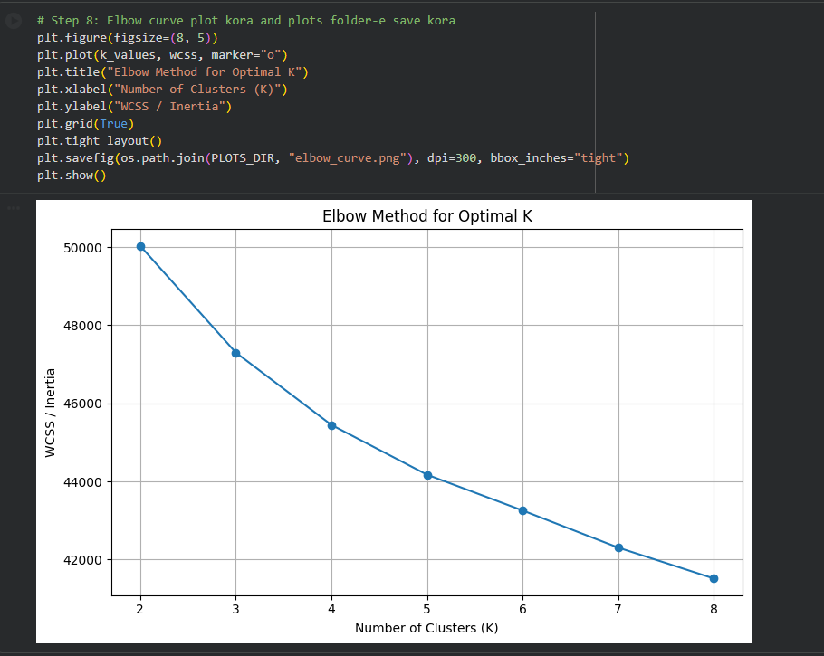
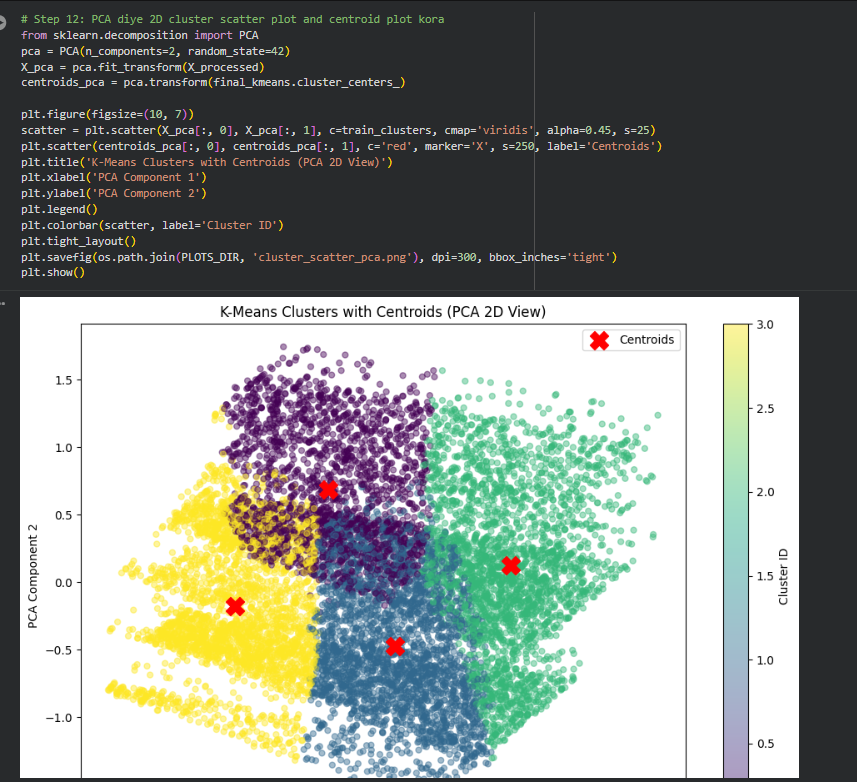

# K-Means Clustering Assignment

This project implements a complete K-Means clustering workflow using a software developer salary/profile dataset and 10 custom software-profile records.

## Repository Structure

```text
dataset/
  train.csv
  custom.csv
model/
  220144.joblib
plots/
  elbow_curve.png
  cluster_scatter_pca.png
  custom_predictions.csv
220144_K-Means.ipynb
README.md
```

## Workflow

1. Clone the GitHub repository in Google Colab.
2. Load the standard/training dataset and the custom dataset automatically.
3. Perform data exploration and preprocessing.
4. Scale numerical features using `StandardScaler`.
5. Select the optimal K using the Elbow Method.
6. Fit the final K-Means model.
7. Save the trained model using `joblib`.
8. Predict clusters for 10 custom data points.
9. Generate the required visual plots.

## Final Visuals

### Elbow Curve



### Cluster Scatter Plot with Centroids



## Cluster Interpretation

After running the notebook, cluster profiles are generated from average experience, salary, country, education, company size, primary language, and primary framework. Update this section with the exact cluster interpretation printed by the notebook.

Example: Cluster 0 may represent mid-experience software profiles, Cluster 2 may represent senior high-salary profiles, and Cluster 3 may represent junior/low-salary profiles.
